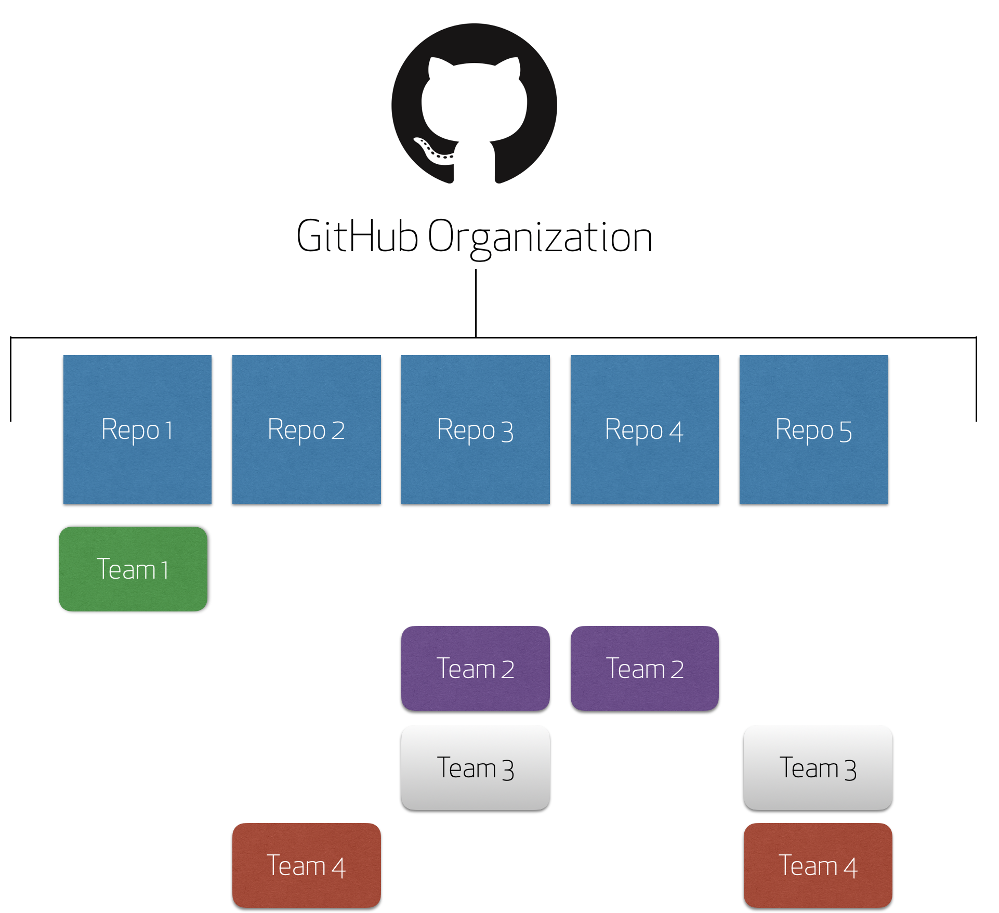

# Getting Started with GitHub Organizations
## What are GitHub Organizations?

An organization is a collection of repositories that are typically maintained by an individual or business.  These repositories can be open source or private based on the goals of the organization.  An additional benefit of GitHub Organizations is the ability to manage individual users with teams.  Teams act as a way to group similar contributors by access permissions or job responsibilities.  Teams also allow an organization to communicate more effectively with a group working on a specific project.

## Lets put this into action:

Meet Stephen.

Stephen started a business using repositories on GitHub.com.  As his business grew, he needed help.  He hired more employees and invited individual employees to work on the repositories on his personal account.

At first, it worked. 

As his company grew, this process became taxing and unsustainable.  Stephen needed a better way to manage his employees and their access to work repositories.  In comes GitHub Organizations. With GitHub Organizations, Stephen was able to create teams for his employees.  

He could now give his teams access to the repositories they needed as opposed to individual employees.  Stephen was able to better manage his employees access on a scalable platform.

Now, Stephen and his company could focus more on their product features and less on access permissions.

With GitHub Organizations, Stephen can:
- [x] Manage all of his repositories from one place
- [x] Organize individual staff into teams
- [x] Provide respository access and privileges to the correct teams
