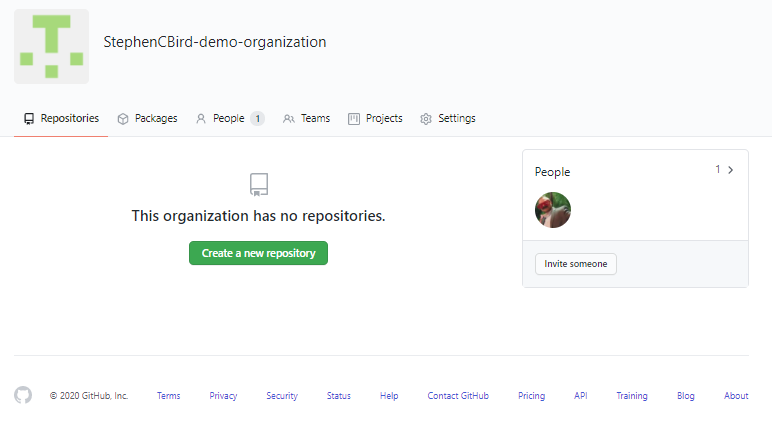

# Creating your first organization

1. While logged into the GitHub homepage, navigate to the top right of your screen to the **+** dropdown and click. Select **New Organization**.

    

1. Once selected, you will be prompted to pick a plan. From here, you can select the appropriate organization plan. For this training, click **Join for free**.

    
 
    **NOTE:** GitHub offers Organizations free of charge to all users. Different plans offer different functionality. For more information, [click here](https://docs.github.com/en/free-pro-team@latest/github/getting-started-with-github/githubs-products#github-free-for-organizations). 

1. Once you have selected **Join for free**, you will be prompted to enter your organization's information. Enter the **Organization account name**, **Contact email**, and then select who the organization belongs to either **My personal account** or **A business or institution**.  For this training select, **A business or institution**.

    

1. Once complete, click **Next**. The following screen will appear:

    

1. Fill out the survey and click **Next**. For this training, put `this is for training purposes` in all **Other** fields. The following screen will appear:

    

1. From here, we can add members by searching by username, full name, or email address.  For this training, click **Skip this step**.

#### Congratulations!
You've just created your first GitHub Organization!

{:.center}

